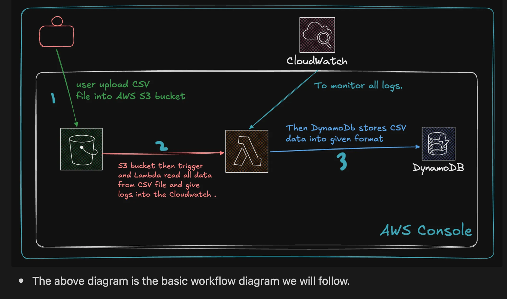

# Cloud-Based File Processing System (Using Localstack)

## Overview
This project implements a cloud-based file processing system that ingests CSV files, extracts metadata, and stores the extracted information in DynamoDB. The system uses Localstack to simulate AWS services locally.

## Architecture Diagram


## Features
- Uploads CSV files to an S3 bucket
- Triggers an AWS Lambda function upon file upload
- Extracts metadata (e.g., column names, row count, file size)
- Stores metadata in a DynamoDB table
- Logs events using CloudWatch

## Prerequisites
- Docker installed (for Localstack)
- AWS CLI installed
- Python (for Lambda function development)
- Boto3 (AWS SDK for Python): `pip install boto3`

## Setup

### Step 1: Create IAM Policy and Role

1. Create an IAM policy with the following JSON:

```json
{
    "Version": "2012-10-17",
    "Statement": [
        {
            "Effect": "Allow",
            "Action": [
                "s3:CreateBucket",
                "s3:ListAllMyBuckets",
                "s3:ListBucket",
                "s3:PutObject",
                "s3:GetObject"
            ],
            "Resource": "arn:aws:s3:::event-driven-project-bucket-csv"
        },
        {
            "Effect": "Allow",
            "Action": [
                "lambda:CreateFunction",
                "lambda:InvokeFunction",
                "lambda:ListFunctions"
            ],
            "Resource": "arn:aws:lambda:us-east-1:123456789012:function:MyS3ProcessorLambda"
        },
        {
            "Effect": "Allow",
            "Action": [
                "dynamodb:CreateTable",
                "dynamodb:ListTables",
                "dynamodb:PutItem",
                "dynamodb:GetItem"
            ],
            "Resource": "arn:aws:dynamodb:us-east-1:123456789012:table/event_data"
        }
    ]
}
```

2. Create an IAM role and attach the above policy.

### Step 2: Create S3 Bucket
1. Navigate to **S3 Console** and create a bucket with a unique name (e.g., `event-driven-project-bucket-csv`).

### Step 3: Create DynamoDB Table
1. Navigate to **DynamoDB Console** and create a table:
   - **Table Name:** `event_data`
   - **Primary Key:** `id` (String)

### Step 4: Create AWS Lambda Function
1. Navigate to **AWS Lambda Console**.
2. Click **Create Function** → **Author from Scratch**.
3. Configure function:
   - **Name:** `MyS3ProcessorLambda`
   - **Runtime:** Python 3.x
   - **Permissions:** Attach the previously created IAM role.
4. Deploy the following code:

```python
import json
import boto3
import csv
import uuid
from datetime import datetime

s3_client = boto3.client('s3')
dynamodb = boto3.resource('dynamodb')
table = dynamodb.Table('event_data')

def lambda_handler(event, context):
    try:
        bucket_name = event['Records'][0]['s3']['bucket']['name']
        object_key = event['Records'][0]['s3']['object']['key']
        
        response = s3_client.get_object(Bucket=bucket_name, Key=object_key)
        content = response['Body'].read().decode('utf-8').splitlines()
        csv_reader = csv.reader(content)
        
        headers = next(csv_reader)
        rows = list(csv_reader)
        row_count = len(rows)
        
        metadata = {
            'event_id': str(uuid.uuid4()),
            'filename': object_key,
            'upload_timestamp': datetime.utcnow().strftime('%Y-%m-%d %H:%M:%S'),
            'file_size_bytes': response.get('ContentLength', 0),
            'row_count': row_count,
            'column_count': len(headers),
            'column_names': headers
        }
        
        table.put_item(Item=metadata)
        
        return {
            'statusCode': 200,
            'body': json.dumps({'message': 'Metadata stored successfully', 'metadata': metadata})
        }

    except Exception as e:
        return {'statusCode': 500, 'body': json.dumps({'error': str(e)})}
```

### Step 5: Testing
1. Upload a CSV file to S3.
2. Verify logs in CloudWatch.
3. Check metadata stored in DynamoDB.

## Conclusion
This project demonstrates a serverless file processing pipeline using AWS services. By using Localstack, you can test AWS services locally before deploying to a real AWS environment.

## License
This project is licensed under the MIT License.

